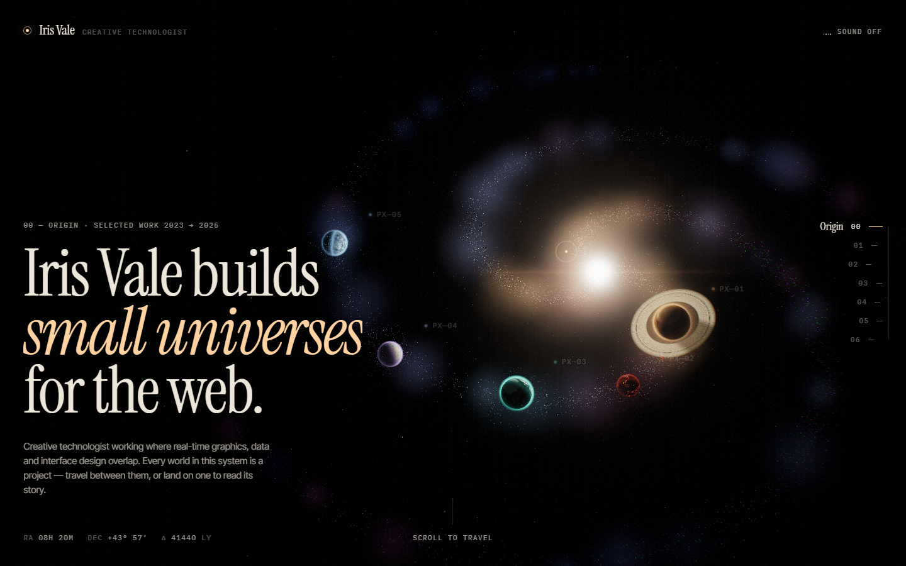
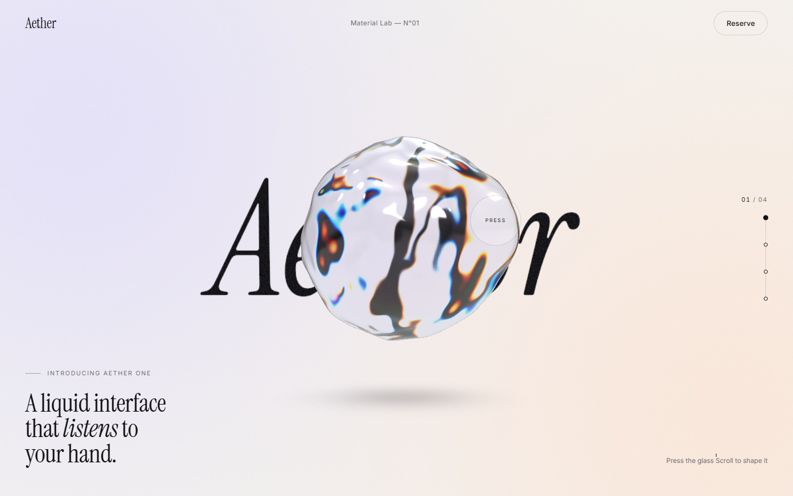
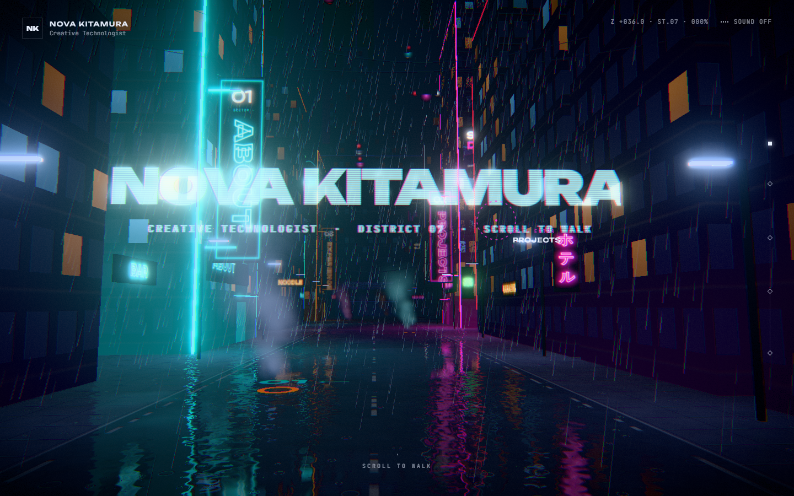
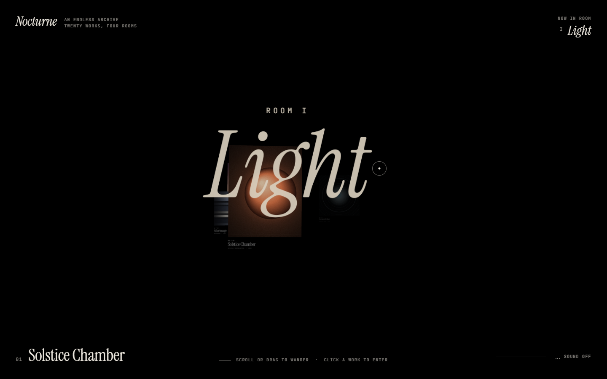
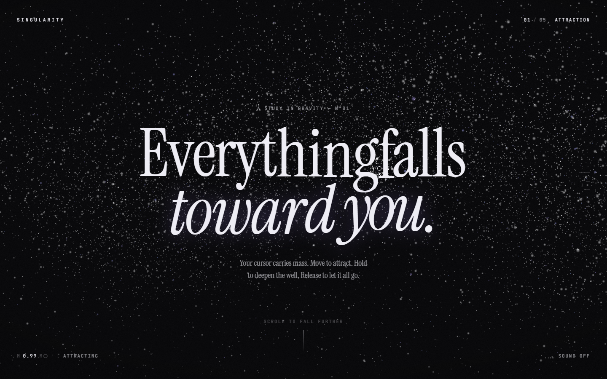
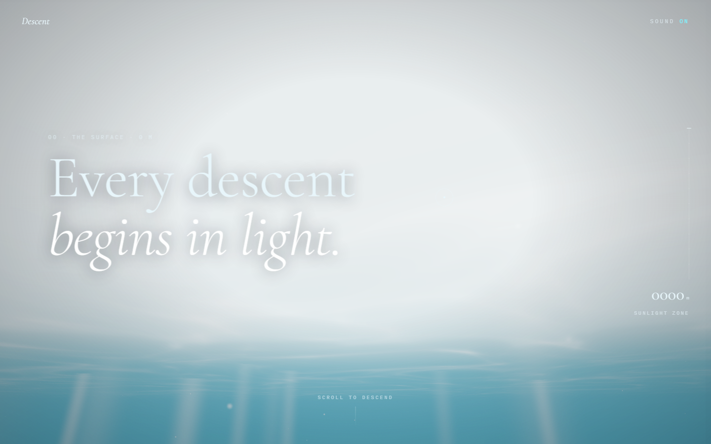
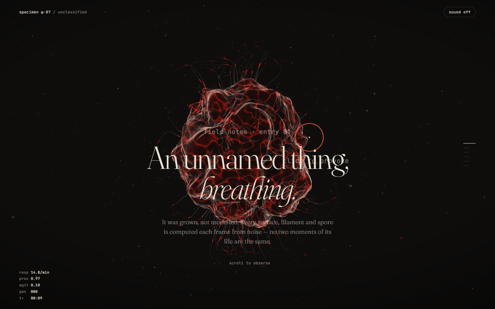
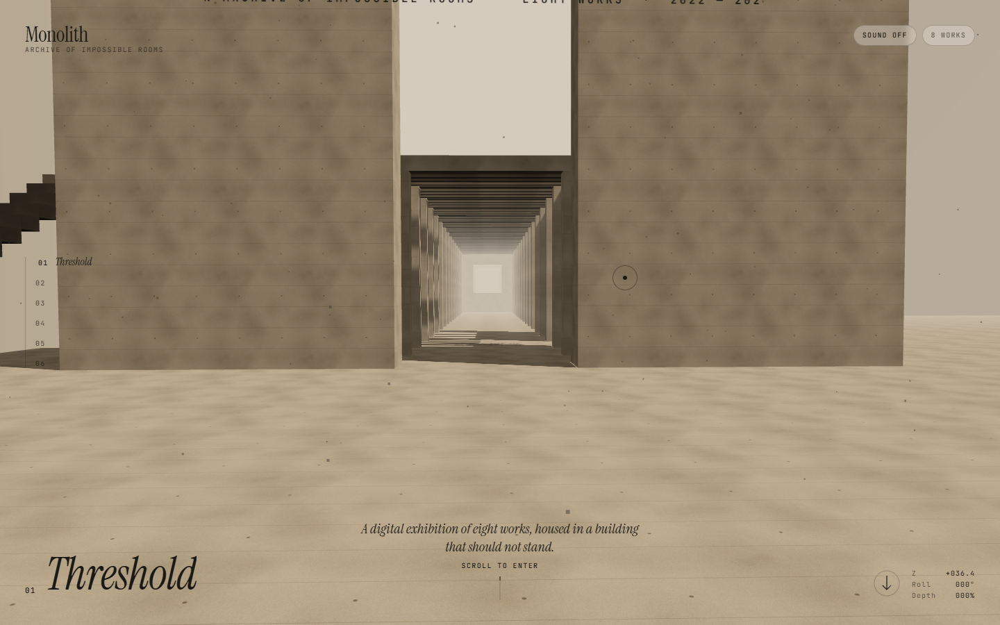
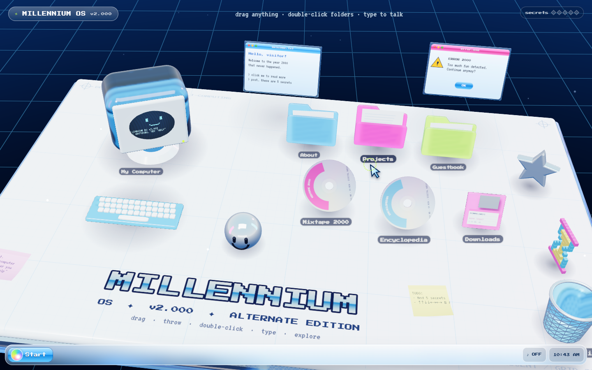
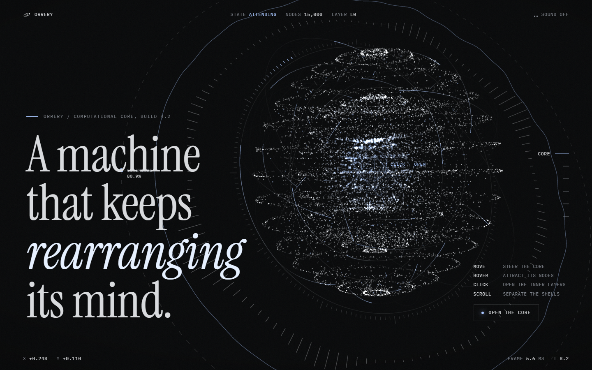

# Opus 5.5 Showcase

10 interactive web experiences. Each project is deployed to GitHub Pages.

**🌐 Live showcase: [https://ohmiler.github.io/opus-5.5/](https://ohmiler.github.io/opus-5.5/)**

| # | Project | Live Demo | Source |
|---|---------|-----------|--------|
| 01 | Interactive Galaxy Portfolio | [Open](https://ohmiler.github.io/opus-5.5/galaxy-portfolio/) | [`01-Interactive Galaxy Portfolio/`](./01-Interactive%20Galaxy%20Portfolio/) |
| 02 | Liquid Glass Product Landing Page | [Open](https://ohmiler.github.io/opus-5.5/liquid-glass-landing/) | [`02-Liquid Glass Product Landing Page/`](./02-Liquid%20Glass%20Product%20Landing%20Page/) |
| 03 | Cyberpunk 3D City Navigation | [Open](https://ohmiler.github.io/opus-5.5/cyberpunk-city/) | [`03-Cyberpunk 3D City Navigation/`](./03-Cyberpunk%203D%20City%20Navigation/) |
| 04 | Infinite 3D Gallery | [Open](https://ohmiler.github.io/opus-5.5/infinite-gallery/) | [`04-Infinite 3D Gallery/`](./04-Infinite%203D%20Gallery/) |
| 05 | Cursor Black Hole | [Open](https://ohmiler.github.io/opus-5.5/cursor-black-hole/) | [`05-Cursor Black Hole/`](./05-Cursor%20Black%20Hole/) |
| 06 | Scroll-Driven Underwater Journey | [Open](https://ohmiler.github.io/opus-5.5/underwater-journey/) | [`06-Scroll-Driven Underwater Journey/`](./06-Scroll-Driven%20Underwater%20Journey/) |
| 07 | Living Digital Organism | [Open](https://ohmiler.github.io/opus-5.5/digital-organism/) | [`07-Living Digital Organism/`](./07-Living%20Digital%20Organism/) |
| 08 | Impossible Architecture Portfolio | [Open](https://ohmiler.github.io/opus-5.5/impossible-architecture/) | [`08-Impossible Architecture Portfolio/`](./08-Impossible%20Architecture%20Portfolio/) |
| 09 | Y2K Retro OS 3D Desktop | [Open](https://ohmiler.github.io/opus-5.5/y2k-retro-os/) | [`09-Y2K  Retro OS 3D Desktop/`](./09-Y2K%20%20Retro%20OS%203D%20Desktop/) |
| 10 | Interactive 3D Personal AI Core | [Open](https://ohmiler.github.io/opus-5.5/ai-core/) | [`10-Interactive 3D Personal AI Core/`](./10-Interactive%203D%20Personal%20AI%20Core/) |

## Screenshots

### 01 · Interactive Galaxy Portfolio

### 02 · Liquid Glass Product Landing Page

### 03 · Cyberpunk 3D City Navigation

### 04 · Infinite 3D Gallery

### 05 · Cursor Black Hole

### 06 · Scroll-Driven Underwater Journey

### 07 · Living Digital Organism

### 08 · Impossible Architecture Portfolio

### 09 · Y2K Retro OS 3D Desktop

### 10 · Interactive 3D Personal AI Core

## Deployment

Pushing to `main` runs [`.github/workflows/pages.yml`](.github/workflows/pages.yml), which calls
[`scripts/build-site.sh`](scripts/build-site.sh):

- Vite projects (01, 03) are built with `npm ci && npm run build` and their `dist/` is published.
- The other projects are plain static sites and are copied as-is.
- Each project lands at `/<slug>/`; the slugs are listed in [`scripts/projects.tsv`](scripts/projects.tsv).

Build locally with `bash scripts/build-site.sh`, then serve `_site/`.
